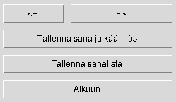

### Asennus

1. Asenna riippuvuudet komennolla:

```bash
poetry install
```

2. Suorita tietokannan alustus komennolla:

```bash
poetry run invoke build
```

3. Sovellus käynnistyy komennolla:

```bash
poetry run invoke start
```


### Kirjautumis näkymä

- Sovellus aukeaa kirjautumisnäkymään jossa kysytään käyttäjätunnusta.
- Mikäli tunnus tai salasana ei ole sovellus ilmoittaa siitä.
- Mikäli tunnusta ei ole, sen voi luoda käyttäjätunnuksen-luonti näkymässä klikkaamalla Luo Tunnus.


### Käyttäjätunnuksen-luonti näkymä

- Annetaan käyttäjänimi ja salasana.
- Käyttäjä tunnuksen on oltava uniikki.
- Valitaan halutessa rooliksi opettaja joka antaa mahdollisuuden luoda ja muokata sanalistoja.


### Opettajan aloitusnäkymä

- Uusi sanalista painikkeella pääsee päänäkymään tekemään uuden sanalistan
- Muokkaa painikkeella voi valita olemassaolevista listoista muokattavaksi päänäkymään
- Lopeta painikkeella suljetaan sovellus


### Opettajan päänäkymä

- Uudelle sanalistalle annetaan nimi
- Listalla pitää olla uniikki nimi ja se ei saa olla tyhjä
- Uudelle sanalistalle annetaan käännösten kieli
- kirjoitetaan sana kenttään Sana ja sen käännös kenttään Käännös.


- Nuolinäppäimillä voi liikkua sanalistassa ja tehdä muutoksia
- Tallenna lisää näkyvissä olevan sanan sanalistaan
- Peru painikkeella pääsee takaisin kirjautumisnäkymään.
- Tallenna lista painikkeella tallennetaan lista tietokantaan



### Oppilaan päänäkymä

- Valitaan harjoitus.
- Vaidaan valita kieli jonka sanalistat halutaan näyttää.
- Lopeta painikkeella suljetaan sovellus


### Harjoitusnäkymä

- Harjoituksessa kirjoitetaan sanan käännös ja tarkistetaan Tarkista painikkeella


- sana oikein


-mikäli sana on kirjoitettu väärin annetaan vihjeenä kirjaimia kunnes joko sana on oikein tai kaikki kirjaimet on annettu.


- Kun kaikki sanat on käännetty oikein näytetään edistymistä kuvaava kaavio jossa tehdyn harjoituksen tilastoidut suoritukset näytetään päivämäärien mukaan. Palkki kuvaa prosentteja ensimmäisellä yrityksellä onnistuneista suhteessa kaikkiin.
- Tämän jälkeen voi palata päänäkymään ja tehdä harjoituksen uudelleen tai valita toisen.


