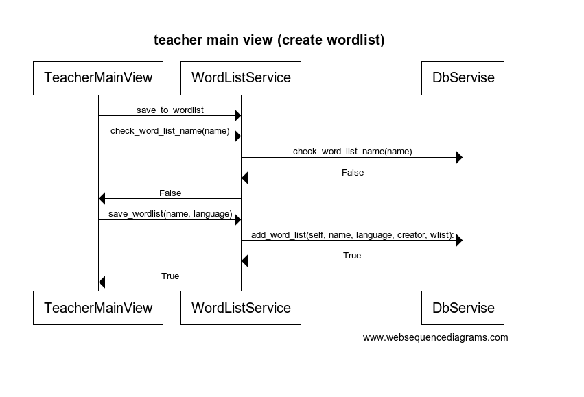
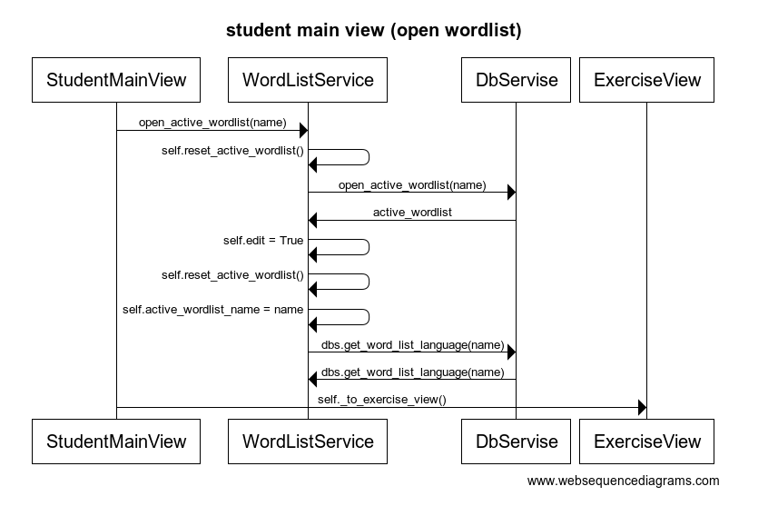

## Arkkitehtuurikuvaus

# Rakenne

Ohjelman rakenne noudattelee kolmitasoista kerrosarkkitehtuuria, ja koodin pakkausrakenne on seuraava:

Pakkaus ui sisältää käyttöliittymästä, app_logic sovelluslogiikasta ja database tietokantatallennuksesta vastaavan koodin. Pakkaus entity sisältää ainoastaan luokan user joka kuvaa käyttäjän tietoja.

# Käyttöliittymä

Käyttöliittymä sisältää kuusi erillistä näkymää:

- Kirjautuminen
- Uuden käyttäjän luominen
- Opettajan aloitusnäkymä
- Opettajan päänäkymä
- Oppilaan aloitusnäkymä
- Harjoitusnäkymä

Nämä ovat toteutettu omina luokkinaan. Näkymien näyttämisestä vastaa UI-luokka ja ne ovat näkyvissä yksittäin. Käyttöliittymä on mahdollisuukien mukaan pyritty eristämään sovelluslogiikasta. Näkymä luokat vastaavat kommunikoinnista käyttäjän kanssa ja kutsuvat word_list_Service luokkaa joka vastaa toiminnallisuudesta sanalistojen ja käyttäjän tietojen osalta.

# Sovelluslogiikka

Sovelluksen tietojen tallennuksesta vastaa luokka DbServise. Käyttöliittymän ja DbServisen tiedonvaihdosta vastaa luokka word_list_Service. Luokka word_list_Service tallentaa käyttöliittymän tarvitsemia tietoja esim muuttujiin: user, wordlist_info, active_wordlist, edit, active_wordlist_name ja active_wordlist_language. Näiden muuttujien arvot päivitetään tarvittaessa. Muutoin luokan tehtävänä on välittää käyttöliittymän tarvitsemat kyselyt DbServise luokalle ja välittää tulokset takaisin käyttöliittymälle.

# Päätoiminnallisuudet

Kuvaus sovelluksen päätoiminnallisuudsta sekvenssikaavioina.

# Käyttäjän lisääminen

Käyttäjätunnuksen luonti näkymässä annetaan käyttäjänimi ja salasana. Valintaruudusta voidaan valita rooliksi opettaja tai mikäli ei valita rooli on oppilas. Luokalle WordListServise lähetetään kysely onko käyttäjätunnus vapaa. WordListServise välittää pyynnön tietokannalle. Mikäli käyttäjänimi on vapaa tallennetaan käyttäjätiedot tietokantaan ja näytetään roolin mukainen alkunäkymä.

Kirjautuminen näkymässä annetaan käyttäjätunnus ja salasana. WordListServise luokka välittää ne tietokantaluokalle joka tarkistaa täsmäävätkö ne. Mikäli eivät annetaan virheilmoitus. Onnistumisen kirjautumisen jälkeen näytetään roolin mukainen alkunäkymä.

.png)

KirjautuOpettajan päänäkymäsää annetaan luodaan uusi sanalista (tai muokataan olemassa olevaa). Kun sanalista tallennetaan kutsutaan WordListServise luokan metodia check_word_list_name joka tarkistaa onko nimi jo käytössä. Mikäli nimi on sopiva tallennetaan sanalista ja onnistuneesta tallennuksesta palautetaan True.

Kun oppilas valitsee sanalistan valikosta kutsutaan WordListServise luokan metodia open_active_wordlist joka hakee sanalistan tietokannasta ja asettaa luokan WordListServise muuttujat. Seuraavaksi kutsutaan Ui luokan metodia to exersice _view joka vaitaa näkymän Harjoitusnäkymäksi.

# Heikkoudet ohjelman rakenteessa

Koska jokaisella näkymällä on oma luokkansa on käyttökiittymäluokissa melko paljon toisteisuutta. Ongelma on tiedostettu ja jatkossa käyttöliittymäsuunittelussa on syytä rakentaa alusta asti mahdollisuus yhdistää toimintoja samaan luokkaan tai muullatavoin pyrkiä vähentämään copypastea.

