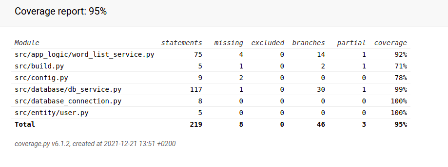

## Testausdokumentti

Ohjelmaa on testattu automatisoiduilla yksikkö- ja integraatiotesteillä unittestilla sekä manuaalisesti järjestelmätasolla.

### Sovelluslogiikka

Sovelluslogiikasta vastaavaa `WordListService`-luokkaa testataan `TestServise` luokan metodeilla. `TestServise`-luokan metodissa setUp tyhjennetään testejä varten luotu tietokanta test-wordlistdb siten että tietokantahaut ja testit tehdään tyhjälle tietokannalle. Sovelluslogiikka testit testaavat myös sovellusta integraatiotasolla.

### Tietokanta-luokka

Tietokantaluokkaa `DbServise` testataan luokan `TestDbServise` luokan metodeilla. `TestDbServise`-luokan metodissa setUp tyhjennetään testejä varten luotu tietokanta test-wordlistdb siten että  tietokantahaut ja testit tehdään tyhjälle tietokannalle.

### Testauskattavuus

Käyttöliittymäkerrosta lukuunottamatta sovelluksen testauksen haarautumakattavuus on 95%

### Järjestelmätestaus

Sovellusta on testattu järjestelmätasolla manuaalisesti.

### Asennus ja konfigurointi

Sovelluksen release-versio on asennettu ja sitä on testattu [Käyttöohjeen](Kayttoohje.md) kuvaamalla tavalla Linux-ympäristössä kannettavalla tietokoneella ja virtuaalityöasemassa.

### Toiminnallisuudet

Sovelluksessa on pyritty välttämään kaikki tilanteet joissa virheellinen syöte voisi aiheuttaa ongelman käymällä läpi kaikki määrittelydokumentissa esitetyt toiminnallisuudet.

### Sovellukseen jääneet laatuongelmat

- Tällä hetkellä ei ole tiedossa tilannetta jossa sovellus antaisi tallentaa tietoa muodossa joka aiheuttaisi myöhemmin ongelmia. Sovellus ei kuitenkaan tarkista ovatko syötteet mielekkäitä tai oikeita ohjelman mielekkään käytön kannalta.

