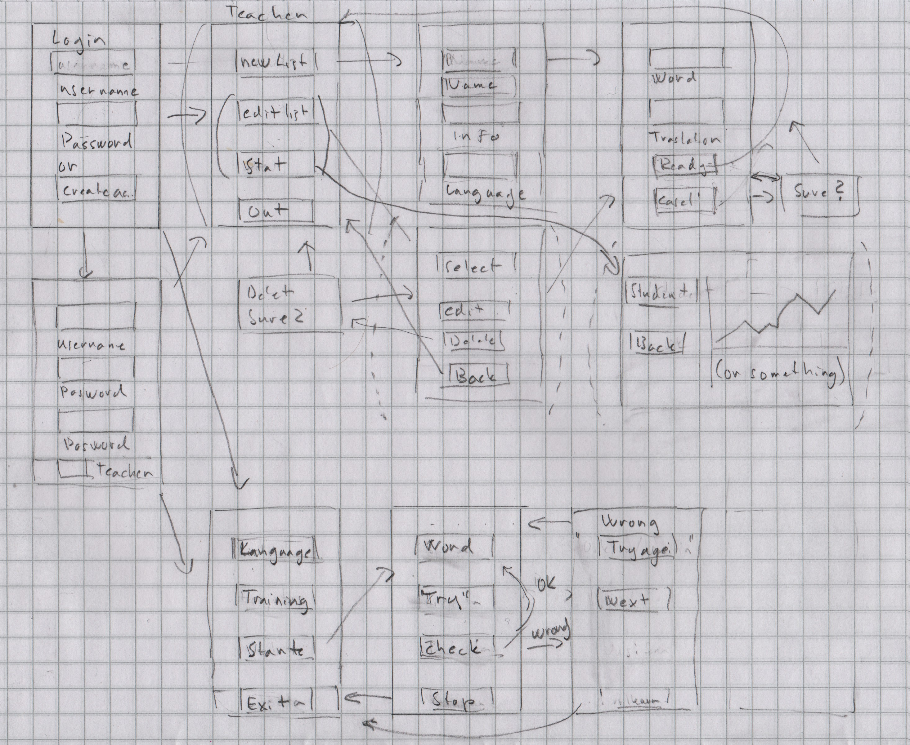

# Vaatimusmäärittely

## Sovelluksen tarkoitus

Sovelluksen käyttötarkoitus on vieraan kielen sanaston harjoittelu.
Sovelluksen pääkieli on suomi
Harjoitus tehdään kirjottamalla suomesta käännetty sana halutulla kielellä

## Käyttäjät

Käyttäjärooleja on kaksi. Opettaja ja oppilas joilla on eri oikeuksia.

- Opettaja voi luoda harjoituksia jotka koostuvat sanalistoista ja niiden käännöksistä.
- oppilas voi valita tehtävän harjoituksen listalta jossa harjoitukset voi jaotella kielien perusteella

## Käyttöliittymäluonnos

Sovellus koostuu kuudesta eri näkymästä

### 1 kirjautumis näkymä

- Sovellus aukeaa kirjautumisnäkymään jossa kysytään käyttäjätunnusta.
- Mikäli tunnus tai salasana ei ole oikein annetaan siitä ilmoitus
- mikäli tunnusta ei ole, sen voi luoda käyttäjätunnuksen-luonti näkymässä

### 2 käyttäjätunnuksen-luonti näkymä

- Annetaan näyttäjänimi ja salasana
- voidaan valita rooliksi opettaja tai oppilas
- käyttäjä tunnuksen on oltava uniikki
- käyttäjätunnus ja salasana tallennetaan tietokantaan

### 3 Opettajan aloitusnäkymä

- Opettajan aloitusnäkymässä voi valita joko uuden sanalista tai olemassa olevan sanalistan muokkauksen
- Muokattavissa olevat sanalistat voidaan jaotella kielen mukaan

### 4 Opettajan päänäkymä

- annetaan harjoitukselle nimi ja kieli
- annetaan uusi sana ja sille käännös
- sanat ja käännökset tallennetaan Tallenna sana painikkeella
- sekä sana että sen käännös on kirjoitettava jotta sana voidaan tallentaa
- nuolinäppäimillä voidaan siirtyä eteen ja taaksepäin
- Sanaoja tai käännöksiä voi myös muuttaa
- muutokset voidaan perua ja palata pää näkymään
- Tallenna sanalista painike tallentaa sanalistan
- sanalista ei voi olla tyhjä ja sillä on oltava sekä nimi että kieli

### 5 Oppilaan päänäkymä

- Oppilaan päänäkymässä voi valita tehtävän harjoituksin nimen ja kielen perusteella (Tämä ei ole vielä toteutettu ja voi olla turha valinta)
- siirrytään harjoitus näkymään
- ellei sanalistoja ole siitä informoidaan

### 6 Harjoitus näkymä

- Kysytty sana käännetään ja kirjoitetaan
- Tarkistus
- Palaute sen mukaan onko oikein vai
- Mikäli tehdään virhe näytetään vihjeenä kirjaimia kunnes sana on oikein tai kaikki kirjaimet on näytetty
- Kun kaikki sanat on käyty läpi näytetään kyseisen harjoituksen tilasto pylväsgrafiikkana jossa prosentteina oikeiden vastausten osuus.

### Ulkoiset kirjastot

- Sovelluksessa on käytetty numpy ja matplotlib kirjastoja.

## Jatkokehitysideoita

- Sovellukseen voisi lisätä toiminnon joka laatisi opeteltavia sanalistoja automaattisesti annetun tekstin sanastosta tai niin että tietty teksti käytäisiin läpi manuaalisesti ja siitä tallennettaisiin halutut sanat.
- Voisi myös tehdä toiminnon jolla käyttäjä voi halutessaan lisätä itselleen listan sanoista jotka ovat tuottaneet virheitä.
- Listoille voisi luoda automaattiset käännökset eri kielille.
-Käyttöliittymää olisi syytä sujuvoittaa. Tämänhetkinen viestiruuduille perustuva toiminnallisuus on kömpelö oikeaan harjoitteluun. Viestit voisi printata esim. ikkunan yläreunaan tai erilliseen viestipalkkiin.

